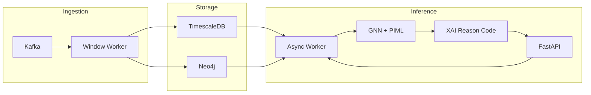

# NTL Detection Engine – Architecture

## High-Level Diagram

## Components

- **Kafka**: Raw telemetry topic `telemetry.raw` (V, I, P, meter_id, timestamp ISO 8601). Partitioning by feeder/meter group for scale.
- **Ingestion worker**: Consumes with event-time; validates (units, bounds); sliding window with grace period; writes aggregated snapshots to TimescaleDB and/or forwards to inference.
- **TimescaleDB**: Time-series storage for V, I, P and window aggregates; retention and downsampling policies.
- **Graph store (Neo4j or PostgreSQL)**: Topology (nodes, edges, R, X, Max_Capacity) with version id. Used for incidence matrix and GNN.
- **FastAPI**: Receives inference request (feeder_id, window_id); enqueues to Celery/Kafka; returns or polls for result (score + reason code).
- **Async worker (Celery)**: Loads GNN, runs inference and Integrated Gradients for reason codes; stores result in Redis/DB for API.

## Scaling to 1M Meters

- **Partitioning**: Kafka topics partitioned by feeder/region (e.g. 10k meters per partition). Multiple consumer instances in the same group.
- **Databases**: Graph DB (Neo4j) for topology and traversals; Time-series DB (TimescaleDB/InfluxDB) for telemetry. Cache hot topology in Redis.
- **Inference**: Scale Celery workers; partition inference by feeder so each worker handles a subset of windows.

## Topology Changes (Dynamic Graphs)

- **Versioned topology**: Each switch/reroute creates a new `topology_version` and new incidence matrix A.
- **Sliding window state**: Windows are keyed by (window_id, topology_version) or the emitted snapshot is tagged with the topology version valid at `window_end`. No in-flight state is dropped; closed windows are immutable.
- **Inference**: Use the graph snapshot for that topology_version when running GNN. On topology update, retrain or fine-tune and version the model; A/B or canary for rollout.

## Model Drift

- Retrain or fine-tune GNN when topology changes (new A, new graph).
- Version model by topology_version; serve the matching model per request.
- Monitor metrics (e.g. precision/recall on holdout) and trigger retraining on drift.
